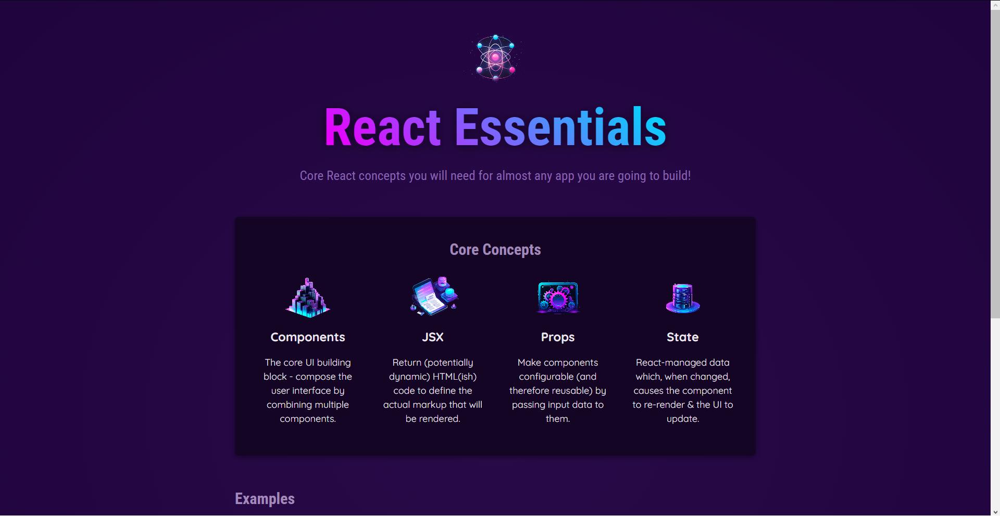

# Guia Essencial de React

Este é um guia rápido, criado para abordar os conceitos essenciais do React, uma biblioteca JavaScript para a construção de interfaces de usuário interativas.

## Componentes

No React, os Componentes são blocos de construção fundamentais. Eles permitem que você divida a interface do usuário em partes independentes e reutilizáveis, chamadas de componentes. Os componentes podem ser simples, como um botão, ou complexos, como um formulário completo.

Exemplo de um componente simples:

```jsx
import React from 'react';

function MeuComponente() {
  return <div>Olá, mundo!</div>;
}

export default MeuComponente;
```

## JSX (JavaScript XML)

JSX é uma extensão de sintaxe do JavaScript que permite escrever códigos que se assemelham a HTML dentro de arquivos JavaScript. Ele facilita a criação de interfaces de usuário no React, tornando o código mais legível e fácil de entender.

Exemplo de JSX:

```jsx
import React from 'react';

function MeuComponente() {
  return <div>
    <h1>Meu Componente</h1>
    <p>Este é um exemplo de JSX.</p>
  </div>;
}

export default MeuComponente;
```

## Props (Propriedades)

Props (Propriedades) são mecanismos para passar dados de um componente pai para um componente filho no React. Eles permitem que os componentes sejam configuráveis e reutilizáveis.

Exemplo de como usar props:

```jsx
import React from 'react';

function Saudacao(props) {
  return <div>Olá, {props.nome}!</div>;
}

export default function App() {
  return <Saudacao nome="João" />;
}
```

## Events (Eventos)

No React, eventos são ações que ocorrem quando o usuário interage com a interface de usuário, como clicar em um botão ou digitar em um campo de entrada. No React, os eventos são tratados de forma semelhante aos eventos em HTML, mas com algumas diferenças de sintaxe.

Exemplo de tratamento de eventos:

```jsx
import React, { useState } from 'react';

function Contador() {
  const [contador, setContador] = useState(0);

  const handleClick = () => {
    setContador(contador + 1);
  };

  return (
    <div>
      <p>Contagem: {contador}</p>
      <button onClick={handleClick}>Clique aqui</button>
    </div>
  );
}

export default Contador;
```

## Estados (useState / React Hooks)

Os estados no React são usados para controlar o comportamento dinâmico dos componentes. O `useState` é um dos Hooks fornecidos pelo React para adicionar estados a componentes de função.

Exemplo de uso do `useState`:

```jsx
import React, { useState } from 'react';

function Contador() {
  const [contador, setContador] = useState(0);

  const incrementar = () => {
    setContador(contador + 1);
  };

  return (
    <div>
      <p>Contagem: {contador}</p>
      <button onClick={incrementar}>Incrementar</button>
    </div>
  );
}

export default Contador;
```



Para mais informações detalhadas, consulte a documentação oficial do [React](https://reactjs.org/).
